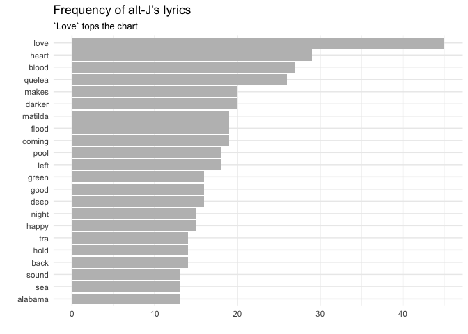
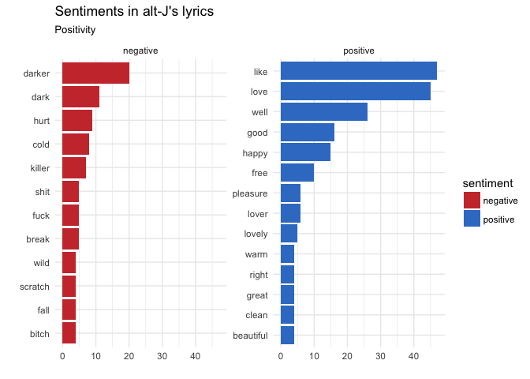
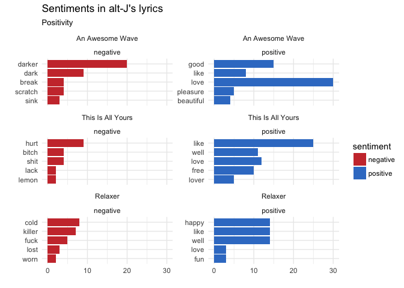
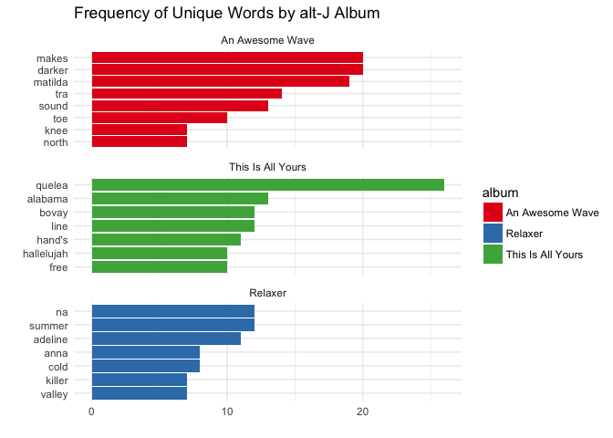
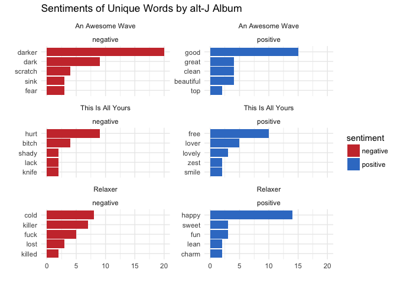

Text Mining alt-J Song Lyrics
================

This project does a brief analysis of British band alt-J’s song lyrics
considering frequency of words and sentiments across albums.

### Load Packages & Data

``` r
library(tidyverse)
library(tidytext)
library(geniusR)
library(gutenbergr)

altj1 <- genius_album(artist = "alt-J", album = "An Awesome Wave") %>% 
  mutate(album = "An Awesome Wave", artist = "alt-J")

altj2 <- genius_album(artist = "alt-J", album = "This Is All Yours") %>% 
  mutate(album = "This Is All Yours", artist = "alt-J")

altj3 <- genius_album(artist = "alt-J", album = "Relaxer") %>% 
  mutate(album = "Relaxer", artist = "alt-J")

altj <- bind_rows(altj1,altj2,altj3)
```

### Frequency and Sentiment Analysis

``` r
# break down sentences by word
altj_lyrics <- altj %>%
  unnest_tokens(word, lyric)

# frequency of words plotted, stop words removed
altj_lyrics %>%
  anti_join(get_stopwords(source = "smart")) %>%
  count(word) %>%
  filter(word != 'la') %>% 
  arrange(desc(n))%>%
  top_n(20) %>%
  ggplot(aes(fct_reorder(word, n), n)) +
  geom_col(fill = "grey") +
  coord_flip() + 
  theme_minimal() +
  labs(title = "Frequency of alt-J's lyrics",
       subtitle = "`Love` tops the chart",
       y = "",
       x = "")
```

<!-- -->

Love tops the chart when it comes to alt-J song lyrics. But what does
the overall sentiment breakdown of alt-J song lyrics look like?

``` r
# sentiments of alt-J's songs
altj_lyrics %>%
  inner_join(get_sentiments("bing")) %>%
  count(sentiment, word) %>%
  arrange(desc(n)) %>% 
  group_by(sentiment) %>%
  top_n(10) %>%
  ungroup() %>%
  ggplot(aes(fct_reorder(word, n), n, fill = sentiment)) +
  geom_col() +
  coord_flip() +
  facet_wrap(~ sentiment, scales = "free_y") +
  theme_minimal() +
  labs(title = "Sentiments in alt-J's lyrics",
       x = "", subtitle = "Positivity ", y = "") +
  scale_fill_manual(values = c("#cc3939", "#397dcc"))
```

<!-- -->

From this image it’s pretty clear that the sentiment of alt-J songs
tends to be positive. But how does this pattern look across different
albums?

``` r
# sentiments of alt-J's songs
altj_lyrics %>%
  inner_join(get_sentiments("bing")) %>%
  count(album, sentiment, word, sort = TRUE) %>%
  mutate(n = jitter(n, 0.01)) %>% 
  group_by(sentiment, album) %>%
  top_n(5, n) %>%
  ungroup %>% 
  ggplot(aes(fct_reorder(word, n), n, fill = sentiment)) +
  geom_col() +
  coord_flip() +
  facet_wrap(~ fct_relevel(album, "Relaxer", after = Inf) + sentiment, scales = "free_y", nrow = 3) +
  theme_minimal() +
  labs(title = "Sentiments in alt-J's lyrics",
       x = "", subtitle = "Positivity ", y = "") +
  scale_fill_manual(values = c("#cc3939", "#397dcc"))
```

<!-- -->

This chart takes the previous graph and separates out by album. Here we
can see that ‘This Is All Yours’ was overwhelmingly positive, while
‘Relaxer’ was still positive, but by a smaller margin. However, there
are repetitions of words between the albums. Can we instead try to find
words that are used more in one album and not the others?

``` r
altj_lyrics_counts <- altj_lyrics %>%
  anti_join(get_stopwords(source = "smart")) %>%
  count(album, word, sort = TRUE)

altj_words <- altj_lyrics_counts %>%
  bind_tf_idf(word, album, n)

altj_words_comp <- altj_words %>%
  bind_tf_idf(word, album, n) %>%
  arrange(-tf_idf)

altj_words_comp %>% 
  mutate(n = jitter(n, 0.01)) %>% 
  group_by(album) %>% 
  top_n(7, tf_idf) %>% 
  ggplot(aes(fct_reorder(word, n), n, fill = album)) +
  geom_col() +
  coord_flip() +
  facet_wrap(~ fct_relevel(album, "Relaxer", after = Inf), scales = "free_y", nrow = 3) +
  theme_minimal() +
  scale_fill_brewer(palette="Set1") +
  labs(x = "", y = "", title = "Frequency of Unique Words by alt-J Album")
```

<!-- -->

This chart shows the frequency of words in alt-J lyrics by album, that
are not used often in other albums. For the curious, a quelea is a bird.

``` r
## with sentiment

altj_lyrics_counts_sentiment <- altj_lyrics %>%
  anti_join(get_stopwords(source = "smart")) %>%
  count(album, word, sort = TRUE) %>% 
  inner_join(get_sentiments("bing"))

altj_words_sentiment <- altj_lyrics_counts_sentiment %>%
  bind_tf_idf(word, album, n)

altj_words_comp_sentiment <- altj_words_sentiment %>%
  bind_tf_idf(word, album, n) %>%
  arrange(-tf_idf)

altj_words_comp_sentiment %>% 
  mutate(tf_idf = jitter(tf_idf, 0.01)) %>% 
  group_by(album, sentiment) %>% 
  top_n(5, tf_idf) %>% 
  ungroup %>% 
  ggplot(aes(fct_reorder(word, n), n, fill = sentiment)) +
  geom_col() +
  coord_flip() +
  facet_wrap(~ fct_relevel(album, "Relaxer", after = Inf) + sentiment, scales = "free_y", nrow = 3) +
  theme_minimal() +
  scale_fill_manual(values = c("#cc3939", "#397dcc")) +
  labs(x = "", y = "", title = "Sentiments of Unique Words by alt-J Album")
```

<!-- -->

Finally, we repeat the same sentiment analysis, except with the unique
words.
